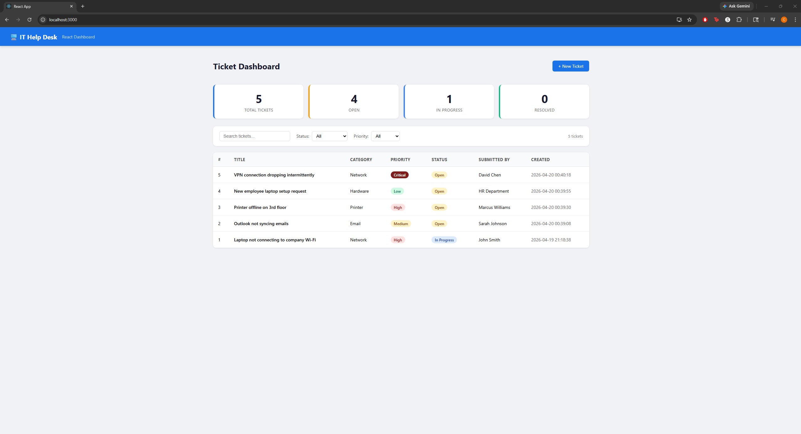
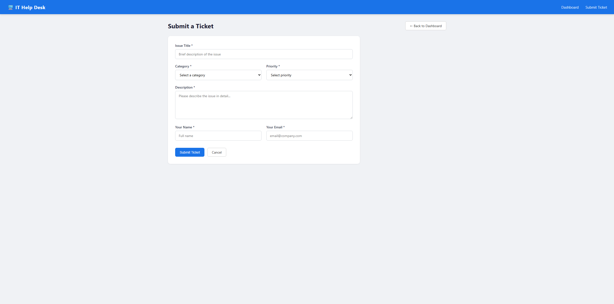
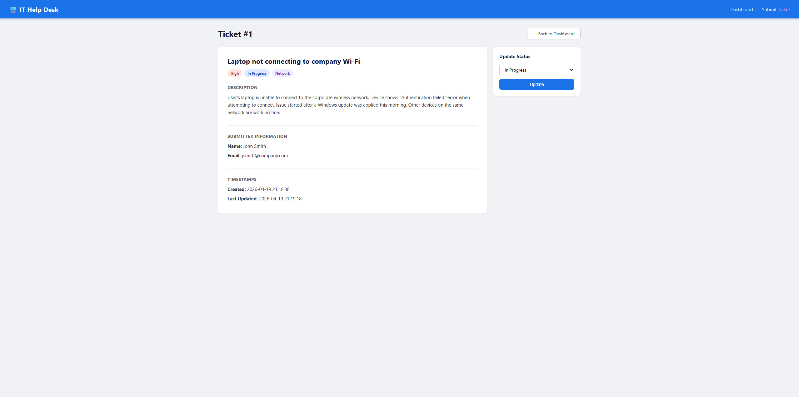

# IT Help Desk Ticket Management System

A full-stack web application for managing IT support tickets, built with Python, Flask, SQLite, React.js, and JavaScript. Designed to simulate the core functionality of enterprise IT service management platforms like ServiceNow and Jira Service Management.

## Features

- **Ticket Submission** — Users can submit IT support tickets with title, category, priority, description, and contact information
- **Dashboard (Flask + Jinja2)** — Server-side rendered dashboard with real-time stats for Total, Open, In Progress, and Resolved tickets
- **React Dashboard** — Client-side React.js frontend consuming the Flask REST API with live filtering, search, and component-based UI
- **Filtering & Search** — Filter tickets by status and priority, search by title or submitter name
- **Ticket Detail View** — Full ticket information with status update capability
- **Status Management** — Update ticket status through the full lifecycle: Open → In Progress → Resolved → Closed
- **REST API** — JSON endpoint at `/api/tickets` for programmatic access to ticket data
- **Persistent Storage** — SQLite database stores all ticket data with timestamps
- **CORS Support** — Flask backend configured with flask-cors to support cross-origin requests from the React frontend

## Tech Stack

| Layer | Technology |
|-------|-----------|
| Backend | Python 3, Flask |
| Database | SQLite3 |
| Frontend (SSR) | HTML5, CSS3, JavaScript, Jinja2 |
| Frontend (SPA) | React.js |
| API | REST (JSON) |
| Cross-Origin | flask-cors |

## Project Structure

```
helpdesk-app/
├── helpdesk.py              # Main Flask application, routes, database logic, REST API
├── templates/
│   ├── base.html            # Base layout with navigation
│   ├── index.html           # Server-side dashboard with stats, filters, and ticket table
│   ├── submit.html          # Ticket submission form
│   └── ticket.html         # Individual ticket detail and status update
├── static/
│   └── style.css            # Custom styling for Flask frontend
├── react-frontend/          # React.js SPA consuming the Flask REST API
│   ├── src/
│   │   ├── App.js           # Main React component — dashboard, filters, search, table
│   │   └── App.css          # React component styles
│   └── package.json
└── screenshots/
    ├── dashboard.png
    ├── submit.png
    └── ticket.png
```

## Getting Started

### Prerequisites
- Python 3.x
- Node.js & npm
- pip

### Backend Setup

```bash
# Clone the repository
git clone https://github.com/cnart003/helpdesk-app.git
cd helpdesk-app

# Install Python dependencies
pip install flask flask-cors

# Run the Flask backend
py helpdesk.py
```

Flask app runs at `http://127.0.0.1:5000`

### React Frontend Setup

```bash
# In a separate terminal
cd react-frontend
npm install
npm start
```

React app runs at `http://localhost:3000`

## API

### GET /api/tickets
Returns all tickets as a JSON array.

```json
[
  {
    "id": 1,
    "title": "Laptop not connecting to Wi-Fi",
    "category": "Network",
    "priority": "High",
    "status": "In Progress",
    "submitter_name": "John Smith",
    "submitter_email": "jsmith@company.com",
    "created_at": "2026-04-19 21:18:38",
    "updated_at": "2026-04-19 21:18:38"
  }
]
```

## Screenshots

### React Dashboard (localhost:3000)


### Submit Ticket


### Ticket Detail


## Architecture

This project demonstrates two frontend approaches consuming the same backend:

1. **Server-Side Rendering (SSR)** — Flask renders HTML using Jinja2 templates, serving complete pages from the server
2. **Single Page Application (SPA)** — React.js fetches data from the REST API and renders the UI client-side

Both frontends connect to the same SQLite database through the Flask backend, showcasing a clean API-first architecture.

## Motivation

Built to demonstrate practical understanding of IT service management workflows — the same processes used in enterprise ITSM platforms like ServiceNow, Jira Service Management, and Microsoft Power Apps. This project reflects real-world help desk operations including ticket triage, priority management, status lifecycle tracking, REST API design, and modern React frontend development.

## Author

Caleb Nartey — [github.com/cnart003](https://github.com/cnart003)